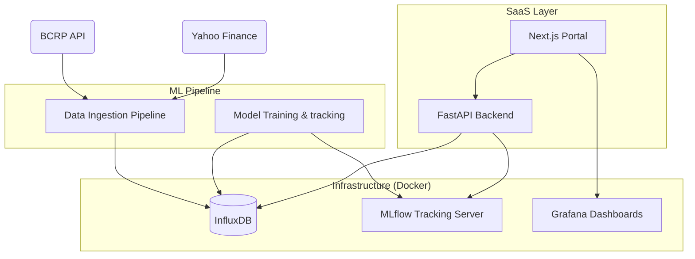

# Forecaster: Macroeconomic Predictive Engine

Forecaster is a production-ready ML platform designed to fetch, store, and analyze macroeconomic indicators and commodity prices (e.g., Copper, USD/PEN) to generate predictive alerts.

## 🏗 System Architecture



## 🚀 Components

### 1. ML Pipeline (`/ml_pipeline`)
- **Data Ingestion**: Fetches historical data from **Yahoo Finance** and **BCRP** (Peruvian Central Bank). Stores everything in InfluxDB.
- **Model Training**: Trains **ARIMA** and **Random Forest** models.
- **MLOps**: Uses **MLflow** to track hyperparameters, metrics (RMSE), and version-control model artifacts.

### 2. SaaS API (`/saas_api`)
- High-performance **FastAPI** engine.
- Provides endpoints for latest prices and 30-day forecasts.
- Integrates with MLflow for dynamic model loading.

### 3. SaaS Frontend (`/saas_frontend`)
- Premium **Next.js** dashboard using Tailwind CSS.
- Features executive alert summaries and embedded Grafana visualizations.

## 🛠 Setup & Installation

### 1. Environment Configuration
Create a `.env` file in the root directory:
```env
INFLUXDB_ADMIN_USER=admin
INFLUXDB_ADMIN_PASSWORD=change-me-please
INFLUXDB_ORG=forecaster
INFLUXDB_BUCKET=market_data
INFLUXDB_TOKEN=your-super-secret-token
```

### 2. Infrastructure (Docker)
Spin up the database and tracking servers:
```bash
docker-compose up -d
```
- **InfluxDB**: [http://localhost:8086](http://localhost:8086)
- **MLflow**: [http://localhost:5000](http://localhost:5000)
- **Grafana**: [http://localhost:3000](http://localhost:3000)

### 3. Data Ingestion & Training
```bash
# In ml_pipeline directory
pip install -r requirements.txt
python data_ingestion.py
python train.py
```

### 4. Running the Platform
```bash
# In saas_api directory
pip install -r requirements.txt
uvicorn main:app --reload

# In saas_frontend directory
npm install
npm run dev
```

## 🧰 Tech Stack
- **Backend**: FastAPI, SQLAlchemy, SQLite
- **Frontend**: Next.js, Tailwind CSS
- **Database**: InfluxDB (Time-series), SQLite (Relational)
- **ML/Ops**: MLflow, Scikit-learn, Statsmodels
- **Infrastructure**: Docker, Grafana
