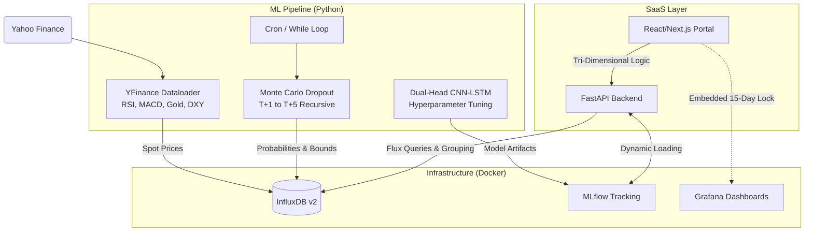

# Forecaster: Macroeconomic Procurement & Trading Engine

Forecaster is a production-ready, state-of-the-art Deep Learning platform designed exclusively for **Directional Forecasting of Silver Futures (`SI=F`)**. 

It transitions mathematical probability into exact corporate instructions across three core dimensions: **Asset Trading**, **Commodity Procurement**, and **Futures Hedging**.

## 🏗 System Architecture



## 🚀 Components & Workflow

### 1. ML Pipeline (`/ml_pipeline`)
This mathematically rigorous pipeline has evolved far beyond traditional arima baselines:
- **Dual-Head CNN-LSTM:** The model predicts **Direction (Probability)** and **Magnitude (Price)** simultaneously using a custom Keras architecture optimized with `compute_class_weight` to perfectly handle imbalanced market returns.
- **Monte Carlo Dropout (MCD):** Rather than outputting a single number, `predict.py` simulates 100 stochastic parallel universes for the live data to extract a true **Incertidumbre** (Uncertainty variance bound).
- **Markovian Generation:** The script auto-regressively pipes T+1 predictions back into itself to create a seamless T+5 future horizon curve, saving outputs mapped meticulously with `URGENT BUY / BUY / WAIT` signals into the `market_forecast` bucket.

### 2. SaaS API (`/saas_api`)
- Operates on a high-performance **FastAPI** engine.
- Retrieves real-time ticker data and unifies highly-fragmented tagged data streams using optimized InfluxDB `|> group()` Flux queries to mathematically guarantee extraction of the nearest T+1 metric across all sub-tables.

### 3. SaaS Frontend (`/saas_frontend`)
- A premium **Next.js** executive dashboard designed with pure visual excellence (Dark/Glass patterns).
- **Tri-Dimensional UI:** Translates complex float probabilities into explicit, actionable mandates:
    - **Asset Trading**: `LONG POSITION / STAY FLAT`
    - **Procurement**: `ACCELERATE INVENTORY / DELAY PURCHASES`
    - **Futures Hedging**: `HEDGE IMMINENT RISK / MAINTAIN HEDGE`
- **Synchronized Charts:** Seamlessly renders a tightly-bound native Grafana iframe restricted perfectly to a rolling window (`now-10d to now+5d`) by enforcing absolute millisecond parameters injected directly via a React rendering cycle map.

## 🛠 Setup & Installation

### 1. Environment Configuration
Create a `.env` file in the root directory:
```env
INFLUXDB_ADMIN_USER=admin
INFLUXDB_ADMIN_PASSWORD=change-me-please
INFLUXDB_ORG=forecaster
INFLUXDB_BUCKET=market_data
INFLUXDB_BUCKET_FORECAST=market_forecast
INFLUXDB_TOKEN=your-super-secret-token
INFLUXDB_URL=http://localhost:8086
MLFLOW_TRACKING_URI=http://localhost:5000
```

### 2. Infrastructure (Docker)
Spin up the database, tracking, and graphing platforms:
```bash
docker-compose up -d
```
- **InfluxDB**: [http://localhost:8086](http://localhost:8086)
- **MLflow**: [http://localhost:5000](http://localhost:5000)
- **Grafana**: [http://localhost:3000](http://localhost:3000)

### 3. Data Ingestion & Training
```bash
cd ml_pipeline
pip install -r requirements.txt
python data_ingestion.py
python train.py
```

### 4. Running the Procurement Engine Platform
Once models exist securely in MLFlow and InfluxDB is populated:
```bash
# 1. Start the Live Inference Auto-Scheduler
python scheduler.py 

# 2. Boot the Gateway API
cd saas_api
pip install -r requirements.txt
uvicorn main:app --reload

# 3. Boot the Executive Dashboard
cd saas_frontend
npm install
npm run dev
```

## 🧰 Tech Stack
- **AI / Deep Learning**: TensorFlow (Keras Dual-Head CNN-LSTM), Scikit-Learn (Joblib Scalers).
- **Backend / Delivery**: FastAPI, Pydantic.
- **Frontend / Client**: Next.js (TypeScript), Tailwind CSS, Lucide Icons.
- **Database / TSDB**: InfluxDB v2 (Flux Lang).
- **MLOps / Platform**: MLflow (Artifact Registry), Grafana, Docker.
